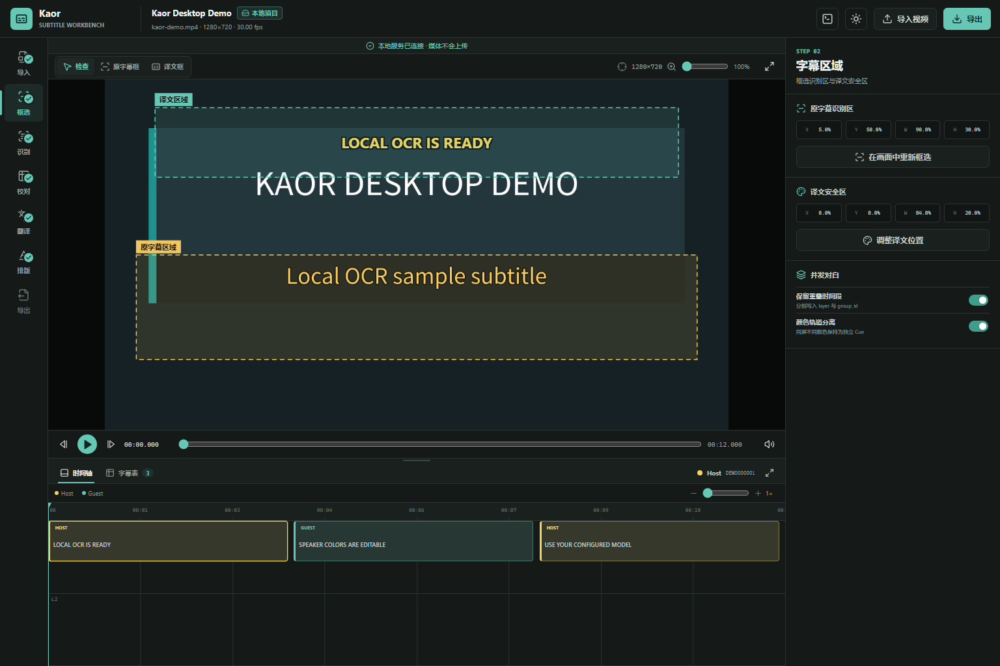

# Kaor

[](https://github.com/Msy-ylzcy/Kaor/actions/workflows/ci.yml)

Kaor 是一个本地优先的视频字幕提取、校对、AI 融合、翻译和烧录工作台。WebUI 默认运行在 `http://127.0.0.1:8765/`，面向桌面端使用。

当前源码版本已经支持字幕、音频、混合三种识别模式。除 AI 融合与 AI 翻译外，视频解码、OCR、UVR5 人声分离、ASR、时间边界精修、说话人聚类、CSV、ASS 和视频渲染均在本机执行。

Windows x64 提供 CPU、AMD 和 NVIDIA CUDA 12.6 三种完整的解压即用包。三个包都自带 Python 运行时、WebUI、FFmpeg、PaddleOCR、PyTorch 音频栈、OCR 模型、字体和音频 Worker。普通用户只需完整解压并双击 `Kaor.exe`，不需要安装 Python、运行 `pip`、创建虚拟环境，也不需要安装 CUDA Toolkit、Node.js 或 UVR5。首次运行 UVR5 人声分离时，Kaor 会从固定上游地址下载匹配的 BS-Roformer YAML，并断点下载约 610 MiB 的 checkpoint；两者分别校验固定大小和 SHA-256 后保存到程序目录，发行包本身不重新分发这两项模型资产。



## 下载与启动

1. CPU/AMD 用户在 [GitHub Releases](https://github.com/Msy-ylzcy/Kaor/releases/latest) 下载对应 ZIP 并完整解压到普通可写目录。
2. NVIDIA 用户把 `Kaor-Windows-x64-NVIDIA-Setup.exe`、`Kaor-Windows-x64-NVIDIA.parts.json` 和从 `.zip.001` 开始的全部分片下载到同一目录，再双击 Setup；它会逐片及整包校验后本地解压。
3. 双击解压目录中的 `Kaor.exe`，浏览器会打开本地 WebUI；手动访问地址默认为 `http://127.0.0.1:8765/`。

| 发行包 | OCR | UVR / ASR / 说话人 | 本地 AI 翻译 | 适用范围 |
| --- | --- | --- | --- | --- |
| `CPU` | CPU | CPU | llama.cpp CPU | 无独显、虚拟机或兼容性优先 |
| `AMD` | **CPU** | **CPU** | llama.cpp Vulkan 使用 AMD GPU | Windows AMD 显卡 |
| `NVIDIA` | Paddle CUDA 12.6 | PyTorch CUDA 12.6 | llama.cpp CUDA | 支持当前驱动的 NVIDIA 显卡 |

**AMD 版不是全流程显卡版，这是当前发行版的明确限制。** Windows 通用发行环境中，PaddleOCR 没有稳定的 AMD GPU 后端，项目使用的 PyTorch 音频链也不能依赖覆盖足够广的 Windows ROCm 运行时。因此 AMD 包的 OCR、UVR5、ASR 和说话人处理固定走 CPU；AMD GPU 只用于 llama.cpp Vulkan 本地翻译。WebUI 会逐阶段显示实际设备，不按包名伪报加速状态。

## 主要能力

- 桌面 WebUI：导入视频、预览、框选区域、启动任务和校对字幕；视频注册后立即探测媒体信息并在本地提取 `cache/audio/mix.wav`，供后续音频任务复用。
- 8 点 ROI 编辑：四个顶点和四条边中点均可拖动，分别设置原字幕识别区和译文显示区。
- `字幕模式`：优先读取内嵌字幕流，否则使用本地 PaddleOCR 识别画面字幕。
- `音频模式`：UVR5 人声分离、GPT-SoVITS 风格静音切分、分片批量 ASR 三个阶段可分别运行，也可一键顺序完成。
- `混合模式`：分别生成 OCR 与 ASR 证据，由 AI 对照两份 CSV 修正重复、渐入误识别、同音字和时间偏差；此步骤只生成源语言字幕，不进行翻译。
- 语言专用 ASR：按语言展示推荐模型；本地缺少所选模型时，任务会自动下载到 `models/asr/`。
- 时间边界精修：结合 ASR 原生时间戳与本地音频能量/VAD，微调字幕开始和结束时间。
- 说话人区分：优先使用 ASR 原生说话人标签；需要时使用本地说话人分段/聚类，并结合 OCR 字幕颜色线索。结果仍可人工校正。
- 重叠字幕：保留独立 `cue_id`、`group_id`、`track_id` 和 `layer`，支持两人同时说话以及先出现一条、随后叠上第二条。
- 实时 OCR：视频字幕区显示最新识别文字，任务卡显示“已处理采样帧/总采样帧”、设备、批次、实际 OCR 帧和复用帧；显存不足时自动缩小当前批次继续处理。
- 完整校对：字幕工作区可展开、拖动调高和独立滚动；支持“最终 / OCR / ASR”三视图、编辑、手动新增和删除字幕。选中最终字幕后可在当前帧临时框选任意区域，单次 OCR 预览并确认覆盖原文。
- 颜色编辑：可只修改当前字幕，也可按 `speaker_id`/人物名一次修改该人物全部字幕；吸管可在对应视频帧取色。
- AI 服务兼容：支持 OpenAI 兼容 `base_url`、API path、API key、自定义请求头、从上游读取模型列表、模型下拉选择和思考强度；也可接入用户已有的 Ollama、LM Studio 或 llama.cpp 服务。
- 本地模型一键部署：检测 CPU、内存、显卡、显存和发行包类型，推荐固定版本的 Qwen3 GGUF，断点下载并校验大小、SHA-256 与 GGUF 文件头，然后安装固定 llama.cpp CPU/Vulkan/CUDA 后端。模型只在用户点击后下载。
- 运行日志页：从顶栏切换到实时日志控制台，按来源、级别和关键词筛选，展开复制完整报错，并直接查看与该日志匹配的维修步骤；导出的诊断 ZIP 自动遮蔽常见 API Key 与 Token。
- 可验证续跑：OCR、UVR5、切片、ASR、AI 融合和翻译会校验源文件、参数与真实产物；完整产物直接复用，OCR/ASR/AI 批次中断后从磁盘 checkpoint 继续。
- OCR 原生热路径：变化检测默认由 OpenCV C++ 执行，可选编译 `_kaor_ocr_native` 融合差分、阈值与计数；PaddleOCR 模型和识别结果不变。
- 目标语言可选，默认 `zh-CN`。
- 翻译输出强制为单行文本；提示词禁止 `/N`、`\\N`、字面 `\\n`、真实换行和 `<br>`，后端也会将这些标记清理为空格。
- ASS 与视频导出：译文使用字幕颜色写入用户选择的译文区域，重叠条目按层排布。

## 三种识别模式

### 字幕模式

适合画面已有清晰字幕的视频。流水线会进行 ROI 变化检测、多帧共识、渐入观察、长驻字幕复用和时间轨道合并，减少重复采样、浅色渐入帧和无意义短字符。进度按实际已处理采样帧除以预计总采样帧计算，不再依赖最后一个视频时间戳。自动批次会读取 PaddlePaddle 报告的实际设备和总显存；常见 16 GB 显卡落在 14 GiB 以上档位，使用 40 帧外层批次和 80 条文本识别批次。若遇到 GPU OOM，当前批次会递归二分到可运行大小，并在任务指标中记录 `ocr_batch_backoffs` 与 `effective_ocr_batch_size`。结果写入：

```text
ocr.csv
source.csv
```

### 音频模式

适合无字幕、字幕质量很差或只需要语音转写的视频。视频导入时已经由 FFmpeg 生成 `mix.wav`，音频识别随后分为三个可复用阶段：

1. `UVR5 人声分离`：读取 `mix.wav`，用 BS-RoFormer 生成 `vocals.wav`。
2. `静音切分`：转为 16 kHz 单声道 `speech-16k-mono.wav`，按稳定静音边界写出 `slices/slice-*.wav` 和 `slices/slices.json`。
3. `ASR 打标`：按切片批量转写，恢复到视频绝对时间，可选时间边界精修和说话人分段，最后生成 `speech.csv` 与当前 `source.csv`。

三个阶段各有独立按钮，适合调参后只重跑受影响的阶段；“一键完成音频三阶段”会按同一组参数依次执行。任务卡持续显示 UVR5 阶段、切分片段序号/总数以及 ASR 已转写切片或批次范围。

静音切分默认参数为：阈值 `-34 dB`、最短片段 `4000 ms`、最短静音 `200 ms`、检测步长 `10 ms`、边界保留静音 `500 ms`、最长片段 `30000 ms`。这些参数均可调整；ASR 默认批大小为 `4`。

结果写入：

```text
speech.csv
source.csv
```

解压版只从程序目录读取由 Kaor 管理的 UVR5 资源：

```text
models\uvr\model_bs_roformer_ep_317_sdr_12.9755.ckpt
models\uvr\model_bs_roformer_ep_317_sdr_12.9755.yaml
```

YAML 和 checkpoint 都在首次运行 UVR5 时从各自固定上游地址下载。YAML 固定为 `2273` 字节，checkpoint 固定为 `639331213` 字节；二者均在启用前核对 SHA-256。Kaor 使用 `audio-separator` 的 BS-Roformer 推理核心，不启动 UVR 图形界面，也不读取用户机器上的 UVR5 安装目录。

### 混合模式

混合模式独立运行 OCR 与音频识别，并保留：

```text
ocr.csv       画面字幕证据
speech.csv    分离人声后的 ASR 证据
```

随后点击“融合校正”，AI 会明确收到哪份来自 OCR、哪份来自 ASR。每个输出子请求都携带完整 `ocr.csv` 与 `speech.csv` 作为只读参考，只要求返回当前子集，因此拆批不会丢失全片上下文。模型根据标题、剧情、人物、置信度、时间、重叠关系输出修正后的 `source.csv`。融合不会生成译文；确认 `source.csv` 后再单独运行翻译，生成 `translated.csv`。

融合前会分别检查文件存在性和字幕行数：`missing=[...]` 表示对应识别阶段尚未产出 CSV，`empty=[...]` 表示 CSV 已存在但没有任何字幕行。两者会给出不同的 409 错误，便于直接回到缺失或空结果的分支处理。

## CSV 分工

| 文件 | 用途 |
| --- | --- |
| `ocr.csv` | OCR 原始证据，保留画面识别置信度、颜色和时间轨道 |
| `speech.csv` | 音频 ASR 原始证据，保留时间、置信度和说话人线索 |
| `source.csv` | 人工校对或 AI 融合后的最终源语言字幕，是翻译输入 |
| `translated.csv` | 翻译副本，包含 `target_text`；不覆盖 `source.csv` |

所有表格使用稳定 `cue_id`。核心字段包括 `start_ms`、`end_ms`、`group_id`、`layer`、`track_id`、`speaker_id`、`speaker_name`、`speaker_color`、`source_kind`、`source_text`、`ocr_confidence`、`target_text` 和 `review_status`。

识别/融合与翻译是严格分开的任务。只提取字幕时，不需要配置 API key，可以直接校对和下载 `source.csv`。

## 工作区重置

“重置工作区”保留已注册的原视频与项目设置，删除 `cache/`、`exports/`、`ocr.csv`、`speech.csv`、`translated.csv` 和旧 `source.csv`，也会清除该项目的内存任务记录。随后 Kaor 重新探测片源的时长、分辨率和帧率，并重新提取 `mix.wav`；新的 `source.csv` 只保留固定表头。重置前需要先取消或等待正在运行的任务。该操作与“删除项目”不同，后者会连同片源一起删除。

## AI 翻译

翻译请求可携带项目标题、视频文件名、源语言、目标语言、故事简介、作品语气、人物资料、术语表、说话人、OCR/ASR 置信度以及前后相邻字幕。模型被要求：

- 按 `cue_id` 一一返回，不增加、删除或重排字幕。
- 结合背景校对低置信度识别结果，并用 `source_correction` 标记修订。
- 保持数字、变量、标签、时间和人物信息。
- `target_text` 只返回单行文本，不输出任何换行标记。

API key 优先存入操作系统凭据管理器，不写入项目 CSV。中转站同样使用其自己的 API key、Base URL、路径和请求头。

中转站返回 HTTP `524` 或请求读取超时时，Kaor 会递归缩小“本次需要返回的字幕子集”，例如 `80 -> 40 -> 20`，但每次仍附带完整源字幕参考表。每个成功子集立即写入 `cache/ai/` checkpoint；重新启动相同任务时只继续未完成的 cue。

上游支持 SSE 且返回 `reasoning_content`/`reasoning` 时，任务浮窗显示真实思考流；未提供独立思考字段的模型只显示阶段、重试、拆批和输出预览，不生成虚构思考内容。

## 可选 C++ OCR 热路径

未编译扩展时，帧签名、差分、阈值和计数已通过 OpenCV 的 C++ 实现运行。安装 Visual Studio C++ Build Tools 与 CMake 后，可进一步构建融合调用：

```powershell
.\scripts\build-native-ocr.ps1
```

成功后后端会自动加载 `_kaor_ocr_native.pyd`；加载失败会自动回退到等价的 OpenCV 路径。任务指标 `frame_change_implementation` 会显示实际实现。

## 从源码运行

源码开发环境为 Windows 10/11 x64、Python 3.12、Node.js 20+ 和 FFmpeg。OCR 使用 PaddlePaddle/PaddleOCR，音频识别使用独立的 PyTorch 子进程，避免 Windows 下 Paddle 与 Torch 的 DLL 冲突。

仓库当前开发环境目录为 `.venv-nvidia-cu126`。新建环境时先显式使用 PyTorch 官方 CUDA 12.6 索引，再安装其余固定依赖，避免系统默认镜像解析成 CPU wheel：

```powershell
py -3.12 -m venv .venv-nvidia-cu126
.\.venv-nvidia-cu126\Scripts\python.exe -m pip install --index-url https://download.pytorch.org/whl/cu126 torch==2.11.0+cu126 torchaudio==2.11.0+cu126 torchvision==0.26.0+cu126
.\.venv-nvidia-cu126\Scripts\python.exe -m pip install -r requirements-nvidia-cu126.txt
```

依赖已经准备好时：

```powershell
npm.cmd ci --prefix apps/web
npm.cmd run build --prefix apps/web
$env:KAOR_DATA_DIR = "$PWD\data"
$env:KAOR_NO_BROWSER = "1"
.\.venv-nvidia-cu126\Scripts\python.exe -m backend.main
```

随后访问 `http://127.0.0.1:8765/`。首次选择尚未安装的语言专用 ASR 时需要联网下载模型；已安装模型、OCR、UVR5、ASR、时间精修、说话人处理和渲染均可在本地运行。

## 隐私与网络

| 操作 | 是否可能联网 | 发送内容 |
| --- | --- | --- |
| 视频导入、OCR、已安装模型后的 UVR5/ASR、校对、ASS、渲染 | 否 | 无 |
| 首次运行 UVR5 且模型资产尚未下载 | 是 | 从固定上游地址下载 YAML 与 checkpoint，不发送视频或音频 |
| 首次下载缺失的 ASR 模型 | 是 | 模型仓库下载请求 |
| 首次下载缺失的 NeMo 说话人模型 | 是 | NVIDIA NGC 模型下载请求 |
| 一键部署本地翻译模型 | 是 | llama.cpp 与所选 GGUF 下载请求 |
| AI 融合 | 是 | `ocr.csv`、`speech.csv` 与用户选择的项目上下文 |
| AI 翻译 | 是 | `source.csv` 与用户选择的项目上下文 |

使用本地翻译服务时，最后两项只请求 `127.0.0.1`；使用在线 API 或中转站时，CSV 与所选上下文会发送到用户配置的地址。

服务默认只监听回环地址。`data/` 中可能包含视频副本、字幕、上下文和导出文件，分享前请自行检查。

## 开发验证

```powershell
.\.venv-nvidia-cu126\Scripts\python.exe -m pytest tests/backend -q
npm.cmd run build --prefix apps/web
.\.venv-nvidia-cu126\Scripts\python.exe -m compileall -q backend kaor.py
```

版本变化见 [Changelog](CHANGELOG.md)，完整使用方法见 [中文使用手册](docs/USER_GUIDE.zh-CN.md)，错误处理见 [中文故障排查](docs/TROUBLESHOOTING.zh-CN.md)，模块与数据流见 [架构和运行原理](docs/ARCHITECTURE.zh-CN.md)，发行构建见 [Windows 发行说明](docs/RELEASE_BUILD.zh-CN.md)。

## 发行完整性

每套 Release 同时提供校验文件和发行清单。包内 `SHA256SUMS.txt` 覆盖全部文件，`RELEASE.json` 记录实际运行档位，`AUDIO-RUNTIME-PROBE.json` 记录打包后音频 Worker 的模块探测。NVIDIA 版的 `parts.json` 额外记录每片与完整 ZIP 的大小和 SHA-256，随包 Setup 会在解压前实际重建并复核整包。运行程序所需的解释器、库和二进制均随发行资产交付；BS-Roformer YAML 与 checkpoint、语言专用 ASR 和可选本地翻译 GGUF 由程序按需下载并管理，下载后仍不需要额外安装环境。

## 许可证

Kaor 源代码采用 [MIT License](LICENSE)。静音切分器的 RMS 与静音边界判断改编自 GPT-SoVITS `tools/slicer2.py`，Copyright (c) 2024 RVC-Boss，按 MIT License 使用；Kaor 的 WAV I/O 与切片清单处理为本地实现，保留的许可证文本位于 `licenses/GPT-SoVITS-MIT.txt`。llama.cpp 使用 MIT License；一键下载的官方 Qwen3 GGUF 使用 Apache-2.0，Kaor 会把固定 revision 对应的上游 `LICENSE` 与模型一起保存。第三方库、模型、字体和二进制文件保留各自许可证，详见 [THIRD_PARTY_NOTICES.md](THIRD_PARTY_NOTICES.md)。
