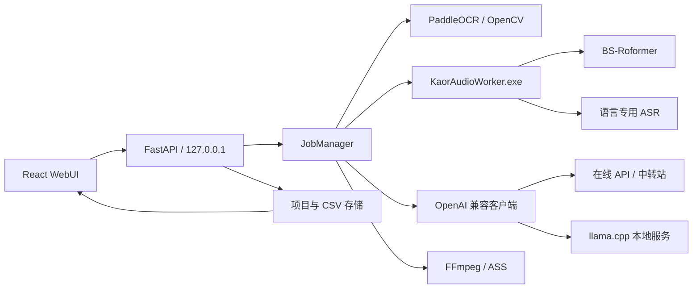

# Kaor 架构与运行原理

本文描述 Kaor 的模块边界、数据流、推理进程、断点策略、硬件档位和发行包结构。它对应 CPU、AMD、NVIDIA 三套 Windows x64 发行包。

## 1. 总体结构



- `Kaor.exe` 启动 FastAPI、任务管理器和本地 WebUI，不负责直接加载重型音频模型。
- `KaorAudioWorker.exe` 是独立子进程，加载 PyTorch、UVR、ASR 和说话人模块。这样可以隔离 Paddle CUDA 与 PyTorch CUDA 的 DLL，并让音频崩溃不拖垮主服务。
- WebUI 只访问回环地址。视频帧、音频和本地模型不经过浏览器上传到外部网络。
- 在线 AI 只接收 CSV 文本和用户明确选择的项目上下文。

## 2. 项目目录

```text
data/
  config.json
  logs/kaor.log
  local-models/
    config.json
    remote-profile.json
    downloads/*.part
    runtime/<llama-version>/<backend>/
    models/*.gguf
    logs/llama-server.log
  projects/<project-id>/
    manifest.json
    video/<source-file>
    ocr.csv
    speech.csv
    source.csv
    translated.csv
    cache/
      task-state.json
      ocr-checkpoint.json
      ai/*-checkpoint.json
      audio/
        mix.wav
        vocals.wav
        speech-16k-mono.wav
        slices/slices.json
        slices/slice-*.wav
        asr-checkpoint.json
        worker-*.log
    exports/
```

四份 CSV 各有单一职责：

| 文件 | 所有者 | 是否可作为最终源字幕 |
| --- | --- | --- |
| `ocr.csv` | 画面 OCR 分支 | 否，只是证据 |
| `speech.csv` | 音频 ASR 分支 | 否，只是证据 |
| `source.csv` | 人工校对或 AI 融合 | 是，翻译输入 |
| `translated.csv` | AI 翻译 | 是，包含 `target_text` 的副本 |

识别和翻译不会共用同一个写入文件。新增、删除或编辑 Cue 时，存储层按 `cue_id` 保持源表和已存在译文表一致。

## 3. 视频导入

1. 复制或注册视频到项目目录。
2. 用 `ffprobe`/FFmpeg 获取时长、分辨率、帧率、视频流和音频流。
3. 提取本地 `mix.wav`，后续音频任务只复用该文件。
4. 写入 `manifest.json`，WebUI 获得可播放的本地媒体 URL。

重置工作区保留原视频与项目设置，删除程序生成的 CSV、缓存和导出，再重新探测媒体并生成 `mix.wav`。正在运行的任务必须先结束或取消。

## 4. OCR 字幕流水线

### 4.1 帧调度

采样器根据视频 FPS 与用户采样频率计算预计总帧数。左右方向键按真实一帧移动，不使用固定毫秒步长。每批完成后任务快照写入：已处理帧、总帧、真实 OCR 帧、复用帧、设备、批量和耗时。

### 4.2 变化检测与复用

ROI 裁剪、灰度/边缘签名、帧差、阈值和像素计数使用 OpenCV C++ 内核；可选 `_kaor_ocr_native.pyd` 把这些操作融合成一次扩展调用。字幕画面未变化时复用上一识别结果，但仍按上限间隔重新检查长驻字幕。

### 4.3 渐入和多帧共识

新文本第一次出现时不会立即定稿。流水线在短观察窗口收集候选，优先选择清晰度、对比度和 OCR 置信度更高的帧，避免把浅色渐入第一帧当成最终文本。高精度模式还会对原图、放大图和对比度变体投票。

### 4.4 去噪、轨道与重叠

- 过滤低置信孤立数字、短 ASCII、播放器 UI 碎片和快速闪烁候选。
- 用文本相似度、位置、颜色和时间连续性把重复采样合并成轨道。
- 同一区域先出现一条、随后叠加第二条时，保留不同 `track_id`/`layer`，不会把两条串成一行。
- 两人同时说话使用相同 `group_id` 的多个 Cue 表示。

### 4.5 批量与显存

自动批量读取 Paddle 实际设备和显存档位。若捕获到 OOM，失败批次递归二分并释放缓存；只调整当前批次，不静默改写用户配置。CPU、AMD 包的 PaddleOCR 使用 CPU，NVIDIA 包可使用 CUDA。

## 5. 音频三阶段

### 5.1 人声分离

`mix.wav` 交给包内 BS-Roformer checkpoint，按重叠窗口分块推理并重建 `vocals.wav`。运行时只解析 `models/uvr`，不扫描外部 UVR5 安装。

### 5.2 静音切分

人声先转成 16 kHz 单声道。切分器的 RMS 和静音边界逻辑改编自 GPT-SoVITS `slicer2.py`，保留阈值、最短长度、最长长度、最短静音、hop 和边界静音参数。每个切片在 `slices.json` 保存绝对采样偏移，因此 ASR 返回的相对时间可无损映射回视频时间。

### 5.3 ASR、时间精修与说话人

- 切片按 `asr_batch_size` 分批送入所选语言专用模型，避免整段长音频一次占满显存。
- checkpoint 按切片 ID 保存已完成结果，中断后跳过完整切片。
- ASR 原生词/句时间戳是第一依据，本地音频能量/VAD 在附近窗口微调开始与结束边界。
- 说话人优先使用 ASR 原生标签，其次使用本地分段/嵌入聚类，混合模式再结合 OCR 颜色。
- 重叠语音保留重叠时间段，不强制串行化。

AMD 包的这一阶段固定使用 CPU PyTorch；Windows AMD 发行版不为 UVR、ASR 或说话人处理声明 AMD GPU 加速。NVIDIA 包使用 CUDA 12.6，CPU 包使用 CPU wheel。

## 6. AI 融合

融合是源语言校正，不是翻译。请求包含：

- 明确标记的完整 `OCR_CSV` 和完整 `SPEECH_CSV`。
- 当前子批需要返回的 Cue ID。
- 视频标题、语言、剧情、人物和术语上下文。
- OCR/ASR 置信度、人物、颜色、时间、层和重叠组。

模型被要求比较两种证据：OCR 更能确认画面写法、颜色和叠层，ASR 更能避免长驻字幕重复并提供发音和时间参考。输出必须保留稳定 ID，不能产生译文。后端再次验证字段、ID、时间和空结果后才原子写入 `source.csv`。

## 7. AI 翻译

翻译读取校对后的完整 `source.csv`。每个子批仍携带全片只读参考，只限制本次返回的 ID，因此拆批不会失去邻接和人物上下文。提示词要求模型自行检查低置信 OCR/ASR 文本，必要时返回 `source_correction`，再生成目标语言。

`target_text` 必须是单行纯文本。提示词禁止 `/N`、`\\N`、字面 `\\n`、真实换行和 `<br>`，解析器还会做第二次清洗。真正换行由本地 ASS 排版器根据译文 ROI、字号和最大行数决定。

HTTP 524 或读取超时时，调度器递归二分“需要输出的行”，完整参考 CSV 不变。每个成功子批立即写 checkpoint；重试同一任务只请求缺失 Cue。

## 8. 本地翻译模型

### 8.1 硬件推荐

硬件探测读取 CPU、内存、发行档位和显卡。NVIDIA 显存优先由 `nvidia-smi` 获取；Windows WMI 的 32 位 `AdapterRAM` 会用驱动注册表的 64 位显存值修正。推荐只决定初始选择，用户可以手动改模型、运行后端和上下文。

### 8.2 安装事务

1. 选择固定版本 llama.cpp 的 CPU、Vulkan 或 CUDA ZIP。
2. 对下载执行断点续传、固定大小和 SHA-256 校验。
3. 在临时目录安全解压，拒绝目录穿越条目，再原子替换运行时目录。
4. 下载固定 revision 的 Qwen3 GGUF，校验字节数、SHA-256 和 `GGUF` 文件头。
5. 从所选 Qwen3 GGUF 的同一固定 revision 下载 Apache-2.0 `LICENSE`，保存到 `models/licenses/`，并把路径写入本地 manifest。
6. 以 `127.0.0.1` 启动 `llama-server`，等待 `/health` 成功。
7. 只有探活成功后才把翻译配置切换到本地 provider。

关闭或失败不会损坏此前在线配置。第一次切到本地时会保存远程 profile；用户可一键恢复。

### 8.3 三套后端

| 发行档位 | llama.cpp | OCR | 音频 |
| --- | --- | --- | --- |
| CPU | CPU x64 | CPU | CPU |
| AMD | Vulkan x64 | CPU | CPU |
| NVIDIA | CUDA 12.4 runtime | CUDA 12.6 | CUDA 12.6 |

本地 LLM CUDA runtime 与 Paddle/PyTorch 版本独立，用户不需要系统 CUDA Toolkit；仍需要足够新的显卡驱动。

## 9. 任务、校验与续跑

`JobManager` 负责排队、取消、进度、结果和错误。每个阶段计算“输入文件指纹 + 参数”签名，并在 `task-state.json` 记录输出：

- 签名相同且输出完整：直接复用。
- 文件缺失、为零、CSV 只有表头、WAV/JSON 无效：从第一处不完整阶段继续。
- OCR/ASR/AI 有细粒度 checkpoint：从最近安全边界继续。
- 参数或输入变化：只使依赖该变化的阶段失效。

完成状态必须建立在真实文件和内容验证上，不能只依赖进度达到 100%。

## 10. 日志与诊断

根日志按 5 MiB 轮转并保留五份。诊断服务合并主日志、启动日志、本地 LLM 日志和项目 Worker 日志；对每一行解析时间、级别、来源和正文，再按固定错误模式关联维修指南。

WebUI 的日志轮询串行执行，不让慢请求互相覆盖。导出的诊断 ZIP 不包含项目 CSV、视频、配置或凭据，并对 Authorization、API key、Token、Secret 和常见 `sk-` 值做遮蔽。

## 11. 字幕布局与导出

原字幕 ROI 和译文 ROI 都使用四顶点加四边中点编辑。译文排版读取人物颜色、`group_id` 和 `layer`，按独立图层、左右分区或顺序堆叠生成 ASS。避免原字幕/人脸属于布局约束；最终 FFmpeg 把 ASS 作为字幕层渲染，不改写原片。

## 12. 发行包

PyInstaller 的一次 `Analysis` 生成 `Kaor.exe` 与 `KaorAudioWorker.exe`，两者共用 `_internal`，避免把大型依赖复制两遍。构建脚本：

1. 按档位创建独立 Python 3.12 环境。
2. CPU/AMD 的 Torch 显式走清华镜像，NVIDIA 显式走 PyTorch 官方 cu126 索引。
3. 构建 WebUI并运行后端测试。
4. 收集 Python、Paddle、Torch、NeMo/FunASR、OCR 模型、UVR 模型、FFmpeg 和字体。
5. 运行打包后的音频 Worker `probe`。
6. 写入依赖清单、发行档位、逐文件 SHA-256、ZIP SHA-256 和 sidecar JSON。
7. 拒绝超过 GitHub 单资产 2 GiB 限制的意外包。

三套发行物都必须交付完整 Python 运行时、原生库、固定 OCR/UVR 资源和音频 Worker。最终用户只需要完整解压并双击，不运行 `pip`、不创建虚拟环境，也不安装 CUDA Toolkit。按需 ASR/GGUF 下载属于应用功能，不是环境安装。

## 13. 许可证边界

Kaor 源码采用 MIT。GPT-SoVITS 改编代码保留其 MIT 文本。llama.cpp 上游采用 MIT；官方 Qwen3 GGUF 仓库采用 Apache-2.0，下载事务同时保存固定 revision 的许可证。BS-Roformer 的 YAML 来源仓库采用 MIT，但这不自动覆盖单独发布的 checkpoint 权重；权重再分发条款必须以模型作者或发布者的明确说明为准。FFmpeg、Paddle、PyTorch、字体和其他依赖继续受各自许可证约束；发行包包含相应通知与来源信息，Kaor 的 MIT 不会重新许可第三方模型或二进制。
